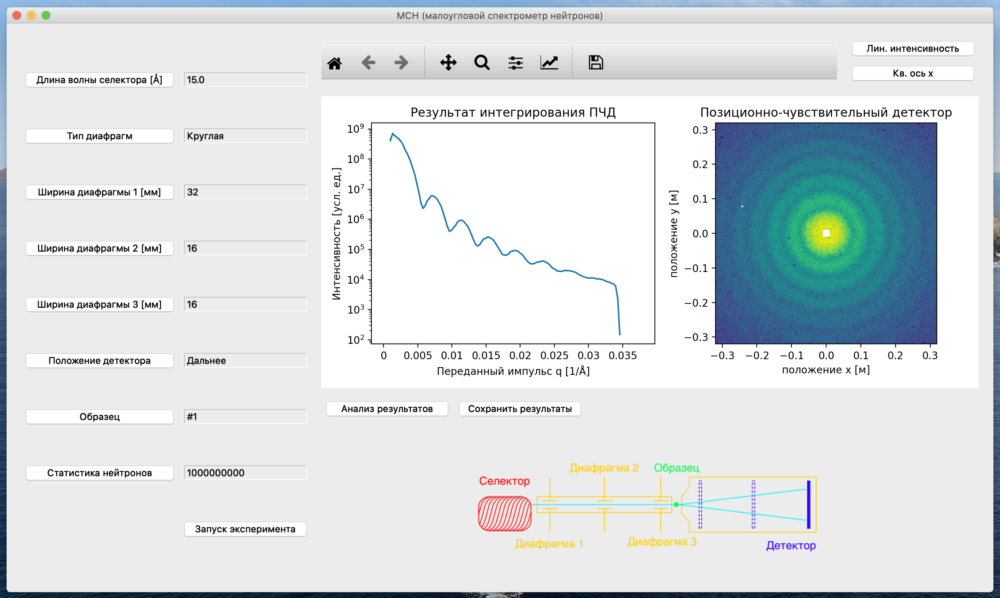

# NeutronLab 
NeutronLab is an educational software package developed for National Research Center 
"Kurchatov Institute". It is a McStas-based neutron instrument simulator, that 
allows hands-on learning the basics of neutron experimentation without going to the 
research reactor.\
 

NeutronLab replicates control hutch user interfaces of eight neutron instruments:
* SANS (on the image above)
* Cold Neutron Diffractometer
* Polarized Neutron Reflectometer
* Triple-Axis Spectrometer
* Thermal Neutron Diffractometer
* Double Crystal Diffractometer
* Single Crystal Diffractometer
* Stress Diffractometer

NeutronLab users can run simulated experiments with various samples and setup 
parameters and perform analysis on the simulated data. 
As this software is intended for Russian students, he language is Russian, but 
the instrument schemes are duplicated in English in folder 
`NeutronLab/mcstas_data/images/EN`, and examples of using the software can
be found at https://youtu.be/hcb8EIq7yXc (SANS) and 
https://youtu.be/ze3CFfcohfI (Thermal Neutron Diffractometer).